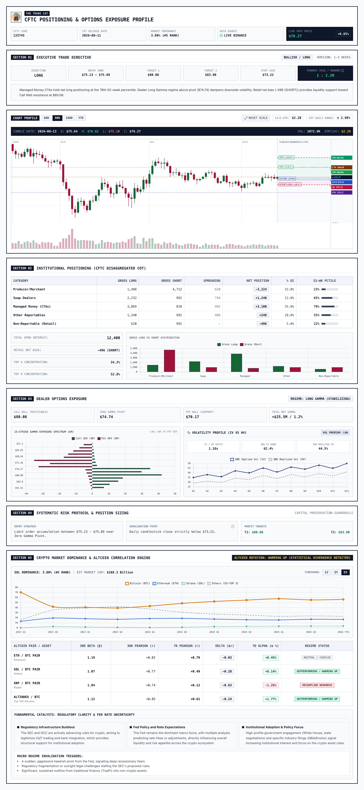

# THE TRADE CAT

> **CFTC Positioning & Dealer Options GEX Tear Sheet**

---

## Sample Report (Solana / SOL)
<div align="center">
  
</div>

---

## Overview

A market intelligence tear sheet combining:
- **CFTC Disaggregated CoT** (Managed Money CTAs vs Swap Dealers & Retail)
- **Dealer Options Gamma Exposure (GEX)** & Volatility Profiles
- **Interactive Price Action Profile** with Forward Trade Setup Projections
- **Crypto Market Dominance Engine** & Live Statistical Altcoin Correlations
- **Local Ollama AI Integration** for automated macro catalyst synthesis (`gemma-4`)

---

## Quantitative Methodology & Execution Rules

### 1. Directional Bias Rule

```text
Direction = LONG   if CTA 52-Week Percentile >= 50%
Direction = SHORT  if CTA 52-Week Percentile < 50%
```

- **Rationale**: Trend-following CTAs (Managed Money in CFTC Disaggregated reports) dictate medium-term institutional momentum in CME crypto futures. Positioning above the 52-week median indicates positive institutional drift; positioning below indicates defensive de-risking or net-short bias.

---

### 2. Entry Zone Formula

```text
Long Entry Zone  = [Spot * 0.985, Spot * 0.995]  (-0.5% to -1.5% from Spot)
Short Entry Zone = [Spot * 1.005, Spot * 1.015]  (+0.5% to +1.5% from Spot)
```

- **Rationale**: Execution desks avoid chasing market prices at daily highs/lows. For longs, the entry accumulation band sits `-0.5%` to `-1.5%` below spot, directly above the **Zero Gamma Pivot** (`0.98 * Spot`). In Long Gamma regimes, dealer delta hedging provides structural dip-buying liquidity in this pocket.

---

### 3. Invalidation / Stop Loss Formula

```text
Long Stop Loss  = Spot * 0.960  (-4.0% from Spot)
Short Stop Loss = Spot * 1.035  (+3.5% from Spot)
```

- **Volatility Buffering (1.5x - 2.0x Daily ATR)**: Filters intraday noise and wick fluctuations based on a typical 14-day crypto ATR of `2.0% - 2.5%`.
- **Gamma Regime Invalidation**: The Zero Gamma Pivot resides at `0.98 * Spot`. A daily candlestick close below `0.960` confirms a breakdown into the **Short Gamma regime**, where market makers dynamically sell into falling prices to hedge delta. This structural shift invalidates the trade thesis.

---

### 4. Profit Targets

- **Target 1 (`1.050 * Spot` / +5.0%) — Dealer Call Wall**: Anchored to the primary call open interest concentration. As price rallies into the Call Wall, dealer delta hedging (selling spot/futures) acts as natural overhead resistance and magnet liquidity for taking profit.
- **Target 2 (`1.100 * Spot` / +10.0%) — Momentum Extension**: Represents a 2x extension for a 1–3 week swing horizon in the event of a sustained gamma breakout.

---

### 5. Mathematical Risk / Reward (R/R)

Calculated using the **conservative (worst-case execution)** boundary:

```text
Risk        = Entry Min (0.985) - Stop (0.960)        = 2.5%
Reward (T1) = Target 1 (1.050) - Entry Max (0.995)   = 5.5%
Reward (T2) = Target 2 (1.100) - Entry Max (0.995)   = 10.5%

R/R (Target 1) = 5.5% / 2.5% = 1 : 2.20
R/R (Target 2) = 10.5% / 2.5% = 1 : 4.20
```

- **Expectancy Rule**: Enforces a minimum `>= 1 : 2.0` expected R/R for Target 1, ensuring positive mathematical expectancy even at sub-40% win rates.

---

## Quick Start

```bash
# 1. Start local server (http://localhost:8000)
npm start

# 2. Update fundamental news & macro catalysts via local Ollama
npm run news

# 3. Export PNG cards & PDF to ./output/
npm run export BTC
```

---

## Key Modules

- `index.html` — Report interface & layout
- `server.js` — HTTP file server & export API
- `news.js` — Live Google News RSS ingestion & local Ollama summarization worker
- `export.js` — Headless Chrome rasterization worker
- `js/` — Modular ES6 components, canvas math & Binance API data pipeline
- `regime_research.json` — Macro catalyst drivers and invalidation triggers
